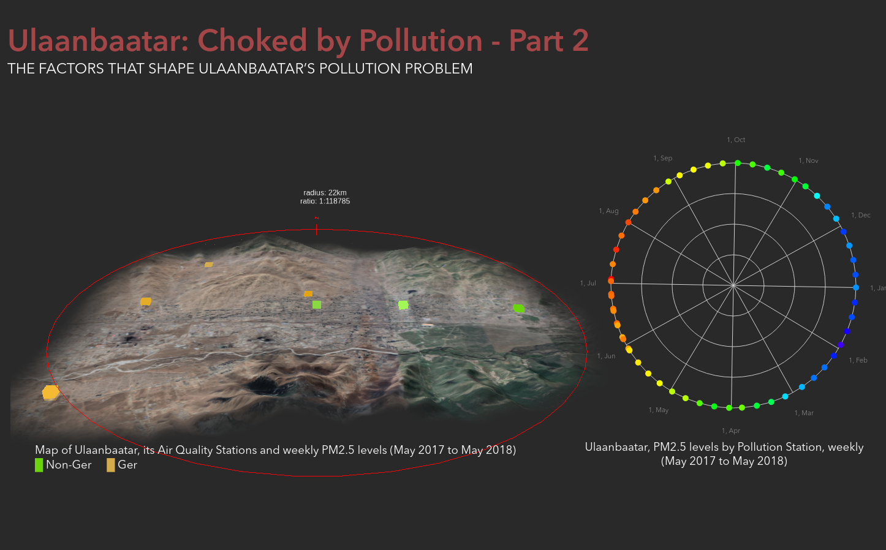

# Ulaanbaatar: Choked by Pollution

This was a project conducted for DECO3100 Information Visualisation Studio to visualise Ulaanbaatar's disproportionately high pollution during the winter and year round.
s
## Pre-setup
1. Ensure you have node (run `node -v` in terminal)
2. If not install node from [nodejs.org](https://nodejs.org/en/)
3. Ensure you have git (run `git -v` in terminal)
4. If not install a git client of your choice ([Github Desktop](https://desktop.github.com/) is a good choice for many)

## Setup
1. Clone the git repo (run `git clone https://github.com/connorgmeehan/deco3100-info-vis-ulaanbaatar` in terminal.  If you're using github desktop run this in _Git Bash_)
2. Navigate into the repo folder `cd deco3100-info-vis-ulaanbaatar`
3. Install the required packages for the project `npm install`
4. Start the dev server `npm run develop`
5. Access the visualisation at localhost on port 8080 (http://localhost:8080/)
